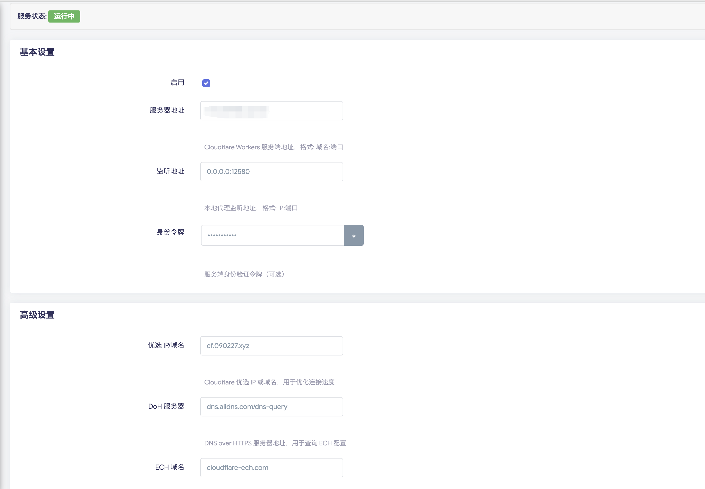
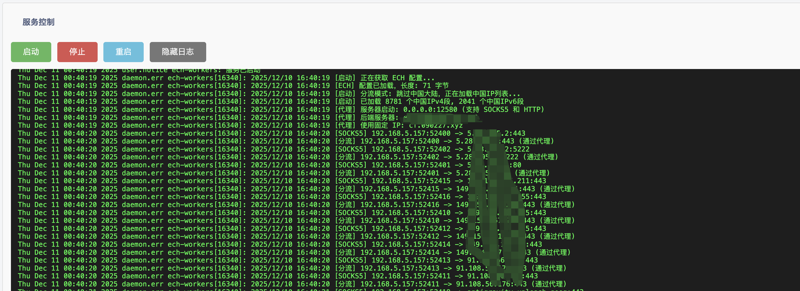

# LuCI App for Tuple ECH Worker

[](https://github.com/byJoey/ech-wk)
[](LICENSE)
[](https://openwrt.org/)

OpenWrt LuCI 图形界面配置应用，用于管理 [ECH Workers](https://github.com/byJoey/ech-wk) 代理服务。

> 🙏 **致谢**: 本项目源自 [SunshineList/luci-app-ech-workers](https://github.com/SunshineList/luci-app-ech-workers)，现作为 [ech-wk](https://github.com/byJoey/ech-wk) 仓库的一部分维护。

---

## ✨ 功能特性

- 🔒 **ECH 加密**: 支持 Encrypted Client Hello (TLS 1.3)，隐藏真实 SNI
- 🌐 **多协议代理**: 同时支持 SOCKS5 和 HTTP/HTTPS 代理协议
- 🇨🇳 **智能分流**: 全局代理 / 跳过中国大陆 / 直连三种模式
- 🔑 **账号密码认证**: 本地代理支持用户名/密码认证（SOCKS5 RFC 1929 / HTTP Basic）
- 🛣️ **透明代理**: 基于 nftables 的 TPROXY 模式，局域网设备免配置自动走代理（HTTP/HTTPS）
- 📊 **Web 管理**: LuCI 图形界面，配置简单直观
- 🔄 **服务管理**: 支持启动/停止/重启，实时查看运行状态和日志
- 🚀 **自动重启**: 基于 procd 的进程管理，服务崩溃自动恢复

---

## 📸 界面截图

### 配置界面



### 日志查看



---

## 📦 安装方法

本应用源码位于 ech-wk 仓库的 `luci-app-ech-workers/` 目录，需要通过 OpenWrt SDK 编译生成 ipk。

### 编译 ipk（需要 OpenWrt SDK / LuCI feed）

```bash
# 在 OpenWrt SDK 目录下
cp -r luci-app-ech-workers package/
./scripts/feeds update -i
make package/luci-app-ech-workers/compile V=s
# 生成的 ipk 位于 bin/packages/*/luci-app-ech-workers_*.ipk
```

> 💡 **提示**: 安装 ipk 后会**自动从 ech-wk Release 检测路由器架构并下载**对应的 `ech-workers` 二进制文件（amd64/arm64/armv7/armv6/mips/mipsle 软路由版），无需手动安装！

### 安装步骤

1. **上传到路由器**

   ```bash
   scp luci-app-ech-workers_*.ipk root@192.168.1.1:/tmp/
   ```

2. **SSH 登录安装**

   ```bash
   ssh root@192.168.1.1
   opkg install /tmp/luci-app-ech-workers_*.ipk
   ```

3. **访问界面**

   打开浏览器访问路由器管理页面，导航到 **服务 → Tuple ECH Worker**

> ⚠️ **注意**: 自动下载需要路由器能访问 GitHub。如果下载失败，可手动下载 `ECHWorkers-linux-<架构>-softrouter.tar.gz`（ech-wk Release）解压出 `ech-workers` 放到 `/usr/bin/ech-workers`

---

## ⚙️ 配置说明

### 基本设置

| 配置项 | 说明 | 示例值 |
|--------|------|--------|
| **启用** | 开启/关闭服务 | ✓ |
| **服务器地址** | Workers 服务端地址 | `your-worker.workers.dev:443` |
| **监听地址** | 本地代理监听端口 | `0.0.0.0:30001` |
| **身份令牌** | 服务端验证密钥 | 可选 |

### 高级设置

| 配置项 | 说明 | 默认值 |
|--------|------|--------|
| **优选 IP/域名** | Cloudflare CDN 优选地址 | `cf.090227.xyz` |
| **DoH 服务器** | DNS over HTTPS 服务器 | `dns.alidns.com/dns-query` |
| **ECH 域名** | 用于获取 ECH 配置 | `cloudflare-ech.com` |
| **代理认证用户名** | 本地代理认证用户名（留空则不启用认证） | 可选 |
| **代理认证密码** | 本地代理认证密码（与用户名配合） | 可选 |

### 分流模式

| 模式 | 说明 |
|------|------|
| **全局代理** | 所有流量通过代理 |
| **跳过中国大陆** | 国内 IP 直连，其他走代理（推荐） |
| **直连模式** | 所有流量直连，不使用代理 |

### 透明代理（TPROXY）

启用后，局域网设备无需任何代理配置即可自动使用代理（仅 HTTP/HTTPS 流量，IPv6 的 80/443 会被阻止以强制回退 IPv4）。

| 配置项 | 说明 | 默认值 |
|--------|------|--------|
| **启用透明代理** | 开启 nftables 透明代理 | 关闭 |
| **透明代理端口** | nftables 将 80/443 重定向到此端口 | `12581` |

---

## 🔧 客户端配置

服务启动后，在需要代理的设备上配置：

| 协议 | 地址 | 端口 |
|------|------|------|
| SOCKS5 | 路由器 IP | 30001（默认） |
| HTTP | 路由器 IP | 30001（默认） |

### 示例

- **Windows**: 系统设置 → 网络和 Internet → 代理 → 手动设置代理
- **macOS**: 系统偏好设置 → 网络 → 高级 → 代理
- **iOS/Android**: WiFi 设置 → 配置代理 → 手动
- **浏览器插件**: SwitchyOmega、FoxyProxy 等

### 启用账号密码认证后

如果配置了「代理认证用户名 / 密码」，客户端需要填写凭据：

- **SOCKS5**: `socks5://用户名:密码@路由器IP:30001`
- **HTTP**: `http://用户名:密码@路由器IP:30001`
- 浏览器 / 应用代理设置中手动填写用户名和密码

---

## 🐛 故障排除

### 查看服务状态

```bash
/etc/init.d/ech-workers status
```

### 查看运行日志

```bash
logread -e ech-workers | tail -n 50
```

### 手动测试运行

```bash
/usr/bin/ech-workers -f your-worker.workers.dev:443 -l 0.0.0.0:30001
```

### 常见问题

| 问题 | 解决方案 |
|------|----------|
| 服务无法启动 | 检查服务器地址是否正确，确保二进制文件有执行权限 |
| 无法连接代理 | 检查防火墙设置，确保监听端口未被占用 |
| 速度慢 | 尝试更换优选 IP 或 DoH 服务器 |

---

## 📁 目录结构

```text
luci-app-ech-workers/
├── Makefile                 # OpenWrt SDK 构建配置
├── README.md                # 说明文档
├── doc/                     # 截图
├── luasrc/
│   ├── controller/          # LuCI 控制器
│   ├── model/cbi/           # CBI 配置模型
│   └── view/ech-workers/    # 视图模板
├── po/                      # 国际化翻译
└── root/                    # 系统配置文件
    ├── etc/
    │   ├── config/          # UCI 默认配置
    │   ├── init.d/          # procd 服务脚本
    │   └── uci-defaults/    # 首次安装脚本
    └── usr/share/rpcd/acl.d # rpcd 权限
```

> **说明**: `ech-workers` 二进制由 ech-wk 仓库的 `ech-workers.go` 统一构建（含 TPROXY 与账号密码认证），LuCI 安装时自动从 ech-wk Release 下载。

---

## 📄 许可证

本项目采用 [GPL-3.0](LICENSE) 许可证。

---

## 🔗 相关链接

- **ECH Workers 核心项目**: [byJoey/ech-wk](https://github.com/byJoey/ech-wk)
- **OpenWrt 官网**: [openwrt.org](https://openwrt.org/)
- **LuCI 文档**: [LuCI Wiki](https://openwrt.org/docs/guide-developer/luci)

---

## 🤝 贡献

欢迎提交 Issue 和 Pull Request！
